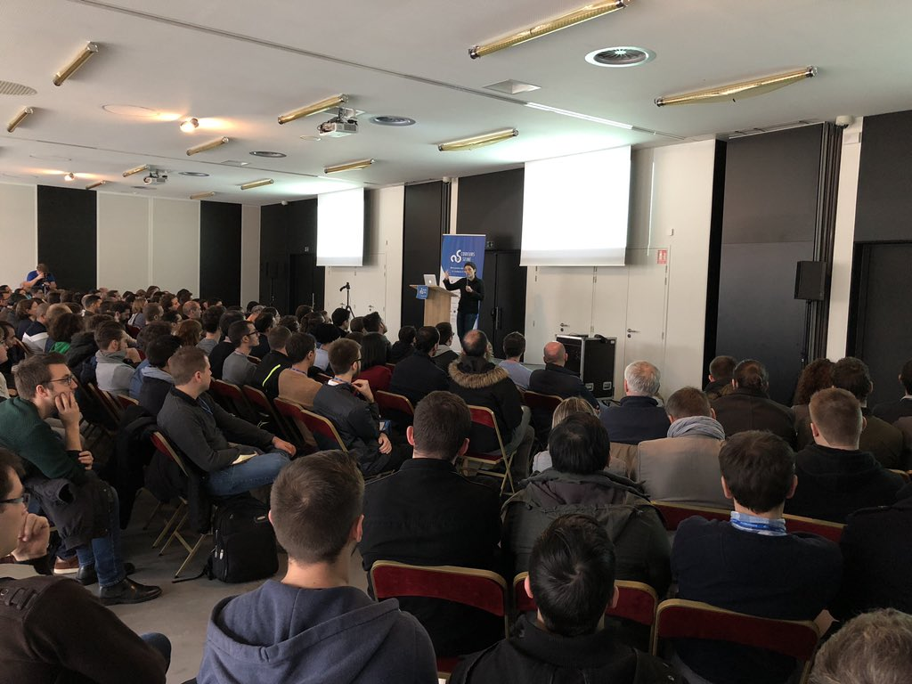

# D'une architecture web MVC à une architecture Clean Hexagonale 

## Cartouche d'identification

 - Manifestation : CodeursEnSeine 2018
 - Lieu : Kindarena Rouen
 - Conférence : D'une architecture web MVC à une architecture Clean Hexagonale 
 - Horaire de la conférence : 11h à 11h50
 - Durée de la conférence : 50 minutes
 - Conférencier(s) :
    - Céline Gilet : 
        - [Lien Twitter](https://twitter.com/celinegilet)
        - [Lien Github](https://github.com/celinegilet)
   
 - Audience : 200 participants
 - Auteur du billet : Wael OSMANI
 - Mots-clés :
    - Architecture Hexagonale
    - Architecture Ports et Adapters
    - Architecture Clean
    - Domain Driven Design
    - Dependency Inversion Principle
    - Separation of Concern
    
 - URL de l'illustration : 

## Support
 - [Lien Slides](https://speakerdeck.com/celinegilet/dune-architecture-web-mvc-a-une-architecture-clean-hexagonale-4cef6e93-0e4a-46ba-a235-3499bde6c773)
 - Nombre de diapos du support : 44 diapos
 - Plan du support :
    1. Prise en main d'une application simple `Happy Town`.
    2. Maintenabilité et évolutivité du code avec une architecture MVC.
    3. Présentation générale des architectures Hexagonale et Clean.
    4. Application, étape par étape, de l'architecture Clean à notre exemple d'application `Happy Town`.
    5. Application de l'architecture Hexagonale à notre exemple d'application `Happy Town`.
    

## Résumé
L'architecture `web MVC` possède plusieurs faiblesses concernant la maintenabilité, l'évolutivité et la testabilité des applications l'utilisant. D'autres types d'architecture comme les architectures `Clean` et `Hexagonale` offrent une approche différente qui permet d'y remédier. Cette approche consiste à se concentrer à 100 % au côté métier de l'application, sans la coupler avec du code technique, comme la gestion de l’infrastructure ou de l’interface utilisateurs.  
En effet une séparation claire doit exister entre les classes du métier et les classes techniques. La relation entre ces deux parties du code doit être telle que les classes techniques dépendent du métier et non l'inverse. Ceci est réalisé grâce à l’exposition par le code métier de `Ports` (ou interfaces) qui définissent une spécification. Ces ports permettent au code technique d’interagir avec le code métier, à travers l’implémentation d’`Adaptateurs` suivant leurs spécifications.  
Le côté technique est divisé en deux : le côté application, c’est ce qui pilote le code métier (comme l’interface utilisateurs) et le côté infrastructure, c’est ce que pilote le code métier pour fonctionner (comme la base de données).  
L’évolutivité et la testabilité de ce genre d’application est donc très simple à réaliser, car il suffit d’implémenter un adaptateur différent pour modifier son comportement.

## Architecture et facteur qualité

Le facteur qualité `Maintenabilité` de l’`ISO9126`, est celui que le sujet peut influer le plus, car comme évoqué dans la conférence, l’architecture `Clean Hexagonale` permet de complètement séparer le code métier du code technique, ainsi que de rendre le code technique dépendant du code métier. Cela permet d’implémenter autant d’adaptateurs que nécessaire pour pouvoir `modifier` et `tester` le code à la guise des développeurs et de la demande client.
